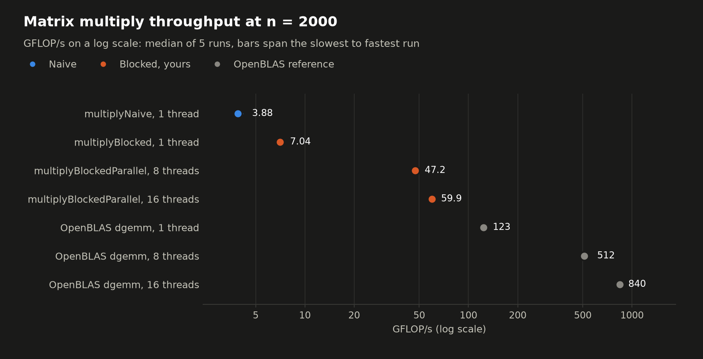
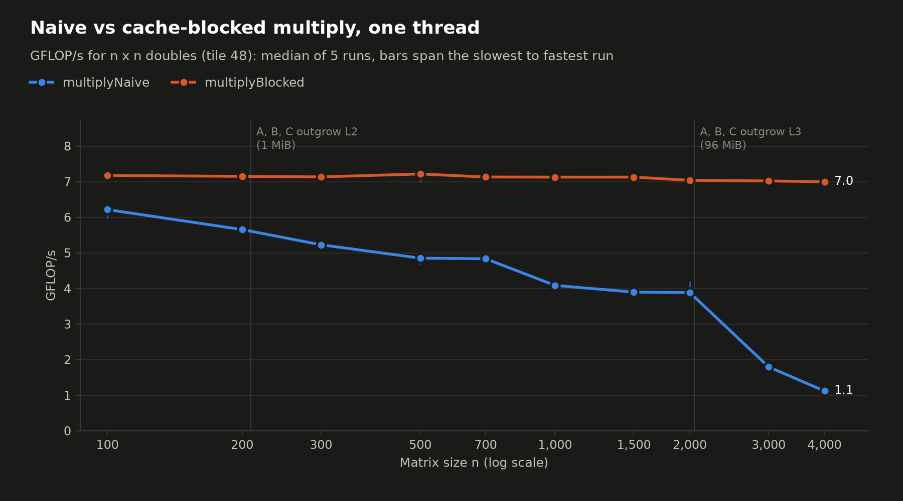
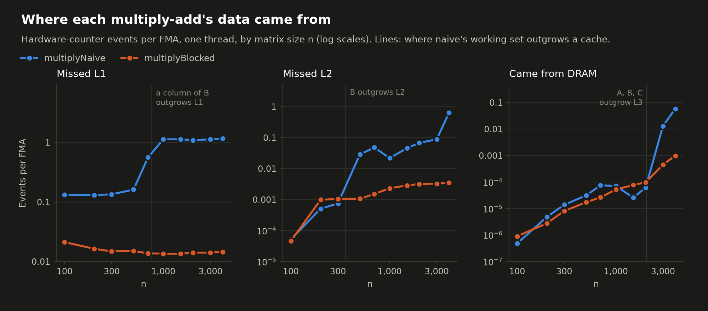
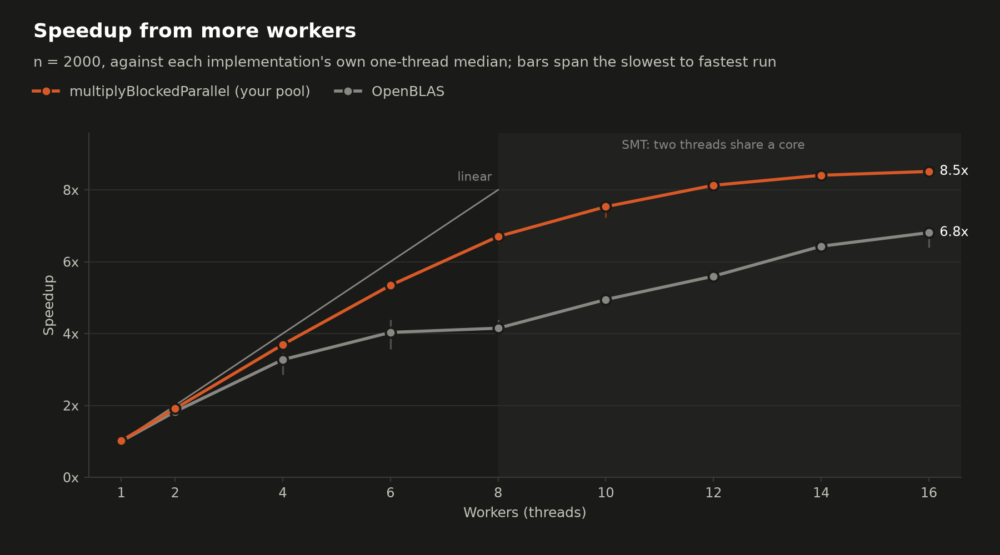
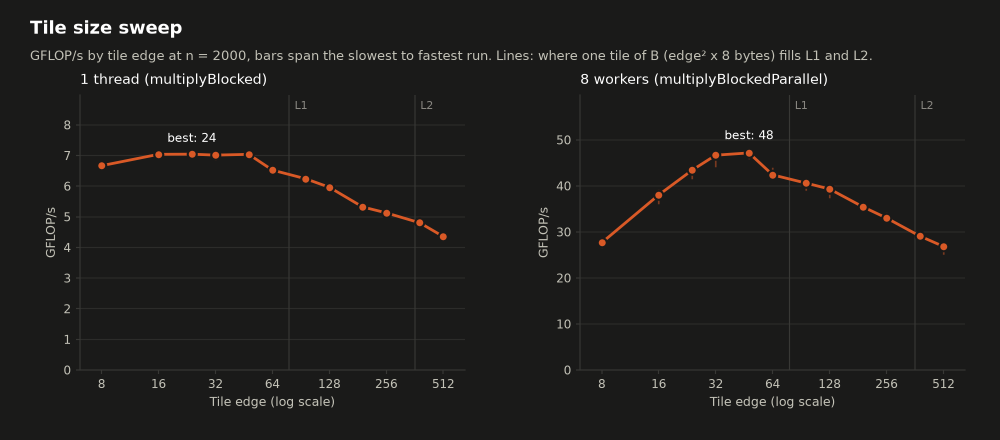

# Benchmarks

Measures the matrix multiply implementations in `include/matmul.hpp` with
[Google Benchmark](https://github.com/google/benchmark), with hardware performance counters
and OpenBLAS as a reference.

| Question | Benchmarks | Chart |
|---|---|---|
| How much faster is cache blocking than the naive loop, and why? | `BM_Naive`, `BM_Blocked` over n = 100 to 4000 | `throughput_vs_size`, `cache_misses` |
| How well does the threadpool version scale? Do 16 workers help on 8 cores? | `BM_BlockedParallel`, 1 to 16 workers at n = 2000 | `thread_scaling` |
| Which tile size is best, and why? | `BM_Blocked` and `BM_BlockedParallel` (8 workers), tile edge 8 to 512 | `tile_sweep` |
| How far is this from a tuned library? | `BM_OpenBLAS`, same sizes and worker counts | `headline` |

<!-- results:start -->

## Benchmark results: v0

- Machine: AMD Ryzen 7 9800X3D 8-Core Processor; 8 cores, 16 hardware threads; L1d 48 KiB and L2 1 MiB per core, L3 96 MiB shared by all 8 cores
- Build: gcc 13.3.0, `-std=c++17 -Wall -Wextra -Iinclude -pthread -O3 -march=native -g -falign-loops=64`, git v0
- Reference: OpenBLAS 0.3.26 NO_LAPACKE DYNAMIC_ARCH NO_AFFINITY Cooperlake MAX_THREADS=64 core=Cooperlake
- Run: 2026-10-04T00:47:28-07:00, median of 5 repetitions, wall-clock time, every result checked with Freivalds' algorithm

### Headline: n = 2000, tile 48



| Implementation | Threads | Time (ms) | GFLOP/s | vs naive | vs OpenBLAS, same threads | CV |
|---|---:|---:|---:|---:|---:|---:|
| multiplyNaive | 1 | 4,119 | 3.88 | 1x | 3.1% | 4.5% |
| multiplyBlocked | 1 | 2,273 | 7.04 | 1.81x | 5.7% | 1.2% |
| multiplyBlockedParallel | 8 | 339 | 47.2 | 12.1x | 9.2% | 1.6% |
| multiplyBlockedParallel | 16 | 267 | 59.9 | 15.4x | 7.1% | 1.0% |
| OpenBLAS dgemm | 1 | 130 | 123 | 31.8x | 100.0% | 1.4% |
| OpenBLAS dgemm | 8 | 31.2 | 512 | 132x | 100.0% | 3.2% |
| OpenBLAS dgemm | 16 | 19 | 840 | 216x | 100.0% | 2.7% |

### By matrix size, one thread





GFLOP/s, then hardware-counter events per multiply-add (N = naive, B = blocked).

| n | Naive | Blocked | Blocked / naive | OpenBLAS | L1D miss N | L1D miss B | L2 miss N | L2 miss B | DRAM fill N | DRAM fill B |
|---|---:|---:|---:|---:|---:|---:|---:|---:|---:|---:|
| 100 | 6.22 | 7.17 | 1.15x | 143 | 0.132 | 0.0212 | 5.22e-05 | 4.55e-05 | 4.77e-07 | 8.98e-07 |
| 200 | 5.66 | 7.15 | 1.26x | 108 | 0.13 | 0.0163 | 0.000504 | 0.00098 | 4.8e-06 | 2.77e-06 |
| 300 | 5.23 | 7.13 | 1.36x | 112 | 0.135 | 0.0148 | 0.000751 | 0.00105 | 1.38e-05 | 8.06e-06 |
| 500 | 4.85 | 7.22 | 1.49x | 115 | 0.162 | 0.0151 | 0.0284 | 0.00106 | 3.13e-05 | 1.73e-05 |
| 700 | 4.83 | 7.13 | 1.48x | 120 | 0.562 | 0.0137 | 0.0483 | 0.00151 | 7.51e-05 | 2.65e-05 |
| 1000 | 4.09 | 7.13 | 1.74x | 119 | 1.13 | 0.0136 | 0.0218 | 0.00232 | 7.12e-05 | 5.19e-05 |
| 1500 | 3.9 | 7.13 | 1.83x | 121 | 1.13 | 0.0135 | 0.0456 | 0.00286 | 2.58e-05 | 7.75e-05 |
| 2000 | 3.88 | 7.04 | 1.81x | 123 | 1.09 | 0.0141 | 0.0675 | 0.00319 | 6.06e-05 | 9.66e-05 |
| 3000 | 1.8 | 7.02 | 3.91x | 125 | 1.13 | 0.0141 | 0.0881 | 0.00326 | 0.013 | 0.000454 |
| 4000 | 1.12 | 7 | 6.25x | 125 | 1.16 | 0.0145 | 0.633 | 0.00347 | 0.0582 | 0.000986 |

### Thread scaling: n = 2000, tile 48



Speedup is against single-threaded multiplyBlocked; efficiency divides it by the physical cores in use (at most 8). GHz is the average clock of the busy cores; IPC is per hardware thread.

| Workers | Time (ms) | GFLOP/s | Speedup | Efficiency | GHz | IPC | L1D miss/FMA | OpenBLAS GFLOP/s | OpenBLAS speedup |
|---|---:|---:|---:|---:|---:|---:|---:|---:|---:|
| 1 | 2,243 | 7.13 | 1.01 | 101% | 5.05 | 6.95 | 0.0142 | 123 | 1 |
| 2 | 1,190 | 13.4 | 1.91 | 96% | 5.04 | 6.6 | 0.0181 | 225 | 1.83 |
| 4 | 615 | 26 | 3.69 | 92% | 5.07 | 6.36 | 0.0205 | 404 | 3.27 |
| 6 | 425 | 37.6 | 5.34 | 89% | 5.09 | 6.12 | 0.0227 | 498 | 4.03 |
| 8 | 339 | 47.2 | 6.7 | 84% | 5.09 | 5.75 | 0.0267 | 512 | 4.15 |
| 10 | 302 | 53 | 7.53 | 94% | 5.08 | 5.2 | 0.0331 | 610 | 4.95 |
| 12 | 280 | 57.2 | 8.13 | 102% | 5.07 | 4.72 | 0.0409 | 691 | 5.6 |
| 14 | 270 | 59.2 | 8.41 | 105% | 5.04 | 4.18 | 0.0507 | 794 | 6.43 |
| 16 | 267 | 59.9 | 8.51 | 106% | 4.99 | 3.78 | 0.0608 | 840 | 6.81 |

### Tile sweep: n = 2000



| Tile | 1 thread GFLOP/s | IPC | L1D miss/FMA | L2 miss/FMA | 8 workers GFLOP/s |
|---|---:|---:|---:|---:|---:|
| 8 | 6.67 | 7.79 | 0.0492 | 0.00784 | 27.7 |
| 16 | 7.04 | 7.38 | 0.0215 | 0.00509 | 38 |
| 24 | 7.04 | 7.18 | 0.0151 | 0.00427 | 43.4 |
| 32 | 7.01 | 6.96 | 0.0164 | 0.00531 | 46.7 |
| 48 | 7.04 | 6.95 | 0.0141 | 0.00319 | 47.2 |
| 64 | 6.52 | 6.28 | 0.0171 | 0.00249 | 42.4 |
| 96 | 6.24 | 5.99 | 0.139 | 0.00132 | 40.6 |
| 128 | 5.96 | 5.65 | 0.137 | 0.000856 | 39.3 |
| 192 | 5.32 | 5.07 | 0.136 | 0.000675 | 35.5 |
| 256 | 5.13 | 4.86 | 0.138 | 0.00155 | 33 |
| 384 | 4.81 | 4.56 | 0.788 | 0.0546 | 29.1 |
| 512 | 4.36 | 4.11 | 1.07 | 0.0931 | 26.8 |

<!-- results:end -->

## Setup

```sh
sudo apt install libbenchmark-dev libbenchmark-tools libopenblas-dev
python3 -m pip install --user --break-system-packages matplotlib scipy   # charts; compare.py uses scipy
```

OpenBLAS is optional. Without it, `make bench` builds everything except `BM_OpenBLAS`.

Ubuntu 24.04 refuses `pip install --user` without `--break-system-packages`; that flag installs
into `~/.local` and leaves system packages alone (a virtual environment also works). Avoid
`apt install python3-matplotlib` if NumPy 2 is installed with pip: Ubuntu's matplotlib is built
against NumPy 1 and will not import next to it.

## Running

| Command | What it does | Time |
|---|---|---|
| `make bench` | Build `build/bench` | |
| `make bench-quick` | One repetition without n = 3000 and 4000. Prints only. | ~2 min |
| `make bench-run` | Five interleaved repetitions, saved to `bench/results/<label>.json` | ~20 min |
| `make bench-plot` | Charts and `summary.md` from that file into `bench/plots/`, and the results section of this README | seconds |
| `make bench-compare BASE=<label>` | Compare two results files with a significance test | seconds |

`<label>` defaults to `git describe --always --dirty`, so a run is named after the commit it
measured (`22af068`, or `22af068-dirty` with uncommitted changes). Name a run yourself with
`LABEL=simd-v1`. Pass extra flags with `ARGS`, for example
`make bench-run ARGS=--benchmark_filter=BM_Blocked/` to run one family, and set the number of
repetitions with `BENCH_REPS=9`.

For clean numbers: close other programs, use the Windows "Best performance" power mode, pause
OneDrive syncing (this repository is inside OneDrive, which uploads every file written during
the run), and leave the machine alone. Then check the CV column; see "Noise" below.

## Methodology

- **Wall-clock time.** Every benchmark uses `UseRealTime()`. The thread that calls
  `multiplyBlockedParallel` sleeps in `waitAll()` while the workers compute, so its CPU time
  would make the parallel version look many times faster than it is. The CPU column is the CPU
  time of the whole process (`MeasureProcessCPUTime()`), so CPU / Time is roughly the number of
  busy cores.
- **What is timed.** The public call, including allocating its result, because callers pay
  for that too. Inputs use fixed seeds and are built outside the timed loop. The pool is
  created outside it, so thread start-up is not timed.
- **Every result is checked.** After timing, `bench::productLooksCorrect` verifies C = A x B
  with Freivalds' algorithm: for a random vector x, A(Bx) must equal Cx up to a rounding-error
  bound. That takes O(n^2) time instead of O(n^3). A wrong result shows up as `ERROR OCCURRED`
  in place of a time, so a fast but broken kernel can never post a number.
- **GFLOP/s** = 2n^3 / time for every variant: one multiply and one add per inner step.
- **Repetitions are interleaved.** `bench-run` runs each benchmark five times in a random
  order across the whole suite, so slow drift (heat, background load) spreads over all
  benchmarks instead of landing on one. Results are medians.
- **No power-of-two sizes.** In calibration runs the current kernels were 5-6x slower at
  n = 1024 and 2048, with 50x more L1 misses, most likely because column walks of B that step
  by a power of two keep landing in the same few cache sets. That would hide every other effect.
  See `TODO.md` for a benchmark of it.
- **Speedup baselines.** Parallel speedup is measured against the best serial code
  (`multiplyBlocked`), not against the parallel code on one worker. The one-worker point shows
  the pool's own overhead. Efficiency divides speedup by the physical cores in use (at most 8).
- **The tile size** used everywhere except the tile sweep is `kBlockSize` in `bench_common.hpp`,
  picked from the tile sweep. Pick it again whenever `multiplyBlock` changes.
- **OpenBLAS** computes into a result allocated once, the way BLAS is normally called. After a
  multithreaded call its idle threads busy-wait for about 60 ms, which would slow down whatever
  runs next, so its benchmark waits that out untimed. Its CPU kernel (`core=Cooperlake` on Zen
  5, which is AVX-512) is recorded in each results file.

### Noise

Each results file has the coefficient of variation (CV = stddev / mean) for every benchmark,
and `summary.md` shows it; the charts draw the slowest-to-fastest range behind each point. Treat
a difference smaller than about twice the CV as noise. What the first full run on this machine
showed:

- The blocked kernel is steady: CV about 1% single-threaded, 2-8% multithreaded.
- Naive at n = 3000 and 4000 runs at one of two speeds about 25% apart, with the same cache-miss
  counts but different IPC, so the misses themselves got slower. The likely cause is address
  translation in the VM, since naive touches a new 4 KiB page on almost every load. The median
  hides this; treat those two points as +-20%.
- Runs that use all 16 hardware threads suffer most from background activity, because one
  delayed thread holds up the whole call. OpenBLAS at 16 threads had a CV of 33%. The pool's
  16-worker runs had 2%, because a shared task queue lets the other workers pick up the slack.
- The `GHz` counter explains some outliers: one slow repetition ran at 4.4 GHz instead of 5.1.

### The machine

AMD Ryzen 7 9800X3D: 8 Zen 5 cores with 2 hardware threads each (SMT), 48 KiB L1D and 1 MiB L2
per core, and 96 MiB of L3 shared by all cores (3D V-Cache). All 8 cores share one L3, so there
are no cross-cluster effects. Each core can start two 512-bit FMAs per cycle, which is
32 double-precision FLOP/cycle: about 160 GFLOP/s per core at 5 GHz. The `FLOP/cycle` counter
compares against that.

**WSL2:** Linux runs in a Hyper-V VM, and Windows decides which physical core runs each virtual
CPU. Pinning inside WSL does not change that: 8 threads pinned to CPUs 0-7 (which Linux reports
as 4 cores x 2 threads) ran as fast as 8 threads on the even CPUs (8 separate cores). So with 8
workers you cannot guarantee one thread per physical core, and some SMT sharing may be in the
numbers.

**Google Benchmark warning:** Ubuntu's package prints `Library was built as DEBUG`. That slows
only the library's own per-iteration bookkeeping, which is nanoseconds against iterations of
14 microseconds to 40 seconds here.

## Hardware counters

Every matmul benchmark reports these per FMA (multiply-add), read with `perf_event_open`
around the timed loop (`perf_counters.hpp`). Counting follows the pool's worker threads.
OpenBLAS reports them only single-threaded, because its threads exist before the counters do.

| Counter | Meaning |
|---|---|
| `GHz` | Cycles / CPU time: the average clock of the busy cores |
| `IPC` | Instructions per cycle, per hardware thread |
| `FLOP/cycle` | Single-threaded runs only. Zen 5 peak is 32. |
| `L1D_miss/FMA` | L1 data-cache read misses |
| `L2_miss/FMA` | Requests that missed L2 (AMD event 0x64; includes instruction fetches) |
| `L3_fill/FMA` | L1D fills served by L3 (AMD raw event 0x44, unit mask 0x02) |
| `DRAM_fill/FMA` | L1D fills served by DRAM (AMD raw event 0x44, unit mask 0x08) |

The L2, L3 and DRAM events are AMD-specific and only enabled on Zen 3 or newer. To check what
they count, a random pointer chase (each load depends on the previous one, so prefetchers cannot
help) was run over working sets of increasing size:

| Working set | L1D miss / load | L2 miss / load | L3 fill / load | DRAM fill / load | Cycles / load |
|---:|---:|---:|---:|---:|---:|
| 16 KiB | 0.00 | 0.00 | 0.00 | 0.00 | 4 |
| 256 KiB | 1.00 | 0.00 | 0.00 | 0.00 | 14 |
| 4 MiB | 1.00 | 0.92 | 0.93 | 0.00 | 57 |
| 32 MiB | 1.00 | 1.02 | 1.00 | 0.01 | 98 |
| 512 MiB | 1.00 | 2.50 | 1.48 | 0.99 | 551 |

Each level turns on exactly when the working set outgrows the cache before it. Counts above 1
at 512 MiB come from page-table walks, which miss too.

## Comparing versions (for the SIMD work)

1. Commit the version you want as the baseline and run `make bench-run`. The results land in
   `bench/results/<commit>.json`.
2. Change `multiplyBlock` and run `make bench-run` again, which writes
   `bench/results/<commit>-dirty.json` (or name it with `LABEL=`).
3. `make bench-compare BASE=<commit> LABEL=<commit>-dirty`

`compare.py` prints the change in time for every benchmark present in both files, with a
Mann-Whitney U test p-value; it wants at least 9 repetitions (`BENCH_REPS=9`) for that test.

For the strictest A/B test, run both builds in the same session, alternating, so drift hits
both equally:

```sh
git worktree add ../threadpool-base <baseline-commit>
make -C ../threadpool-base bench
python3 /usr/share/benchmark/compare.py benchmarks ../threadpool-base/build/bench ./build/bench \
    --benchmark_filter=BM_Blocked/ --benchmark_repetitions=9
```

Benchmarks are matched by name, and the name includes the tile size (`bs:48`). Compare at the
same tile size first, then re-run the tile sweep for the new kernel.

## Charts

`make bench-plot` writes each chart as `<name>.png` on a dark background, and
`bench/plots/summary.md` shows every chart above the numbers behind it as Markdown tables. A
chart that needs a benchmark the run did not include (for example `BM_Naive`, when filtered out)
is skipped, and so are table columns with no data.

The results section near the top of this README is the same summary. `make bench-plot` rewrites
everything between the `<!-- results:start -->` and `<!-- results:end -->` lines (invisible on
GitHub) and nothing else, so edit outside them. To show results somewhere else, move the two
lines. Plotting with `python3 bench/plot.py` directly leaves the README alone unless you pass
`--readme README.md`.

## Files

| File | Contents |
|---|---|
| `matmul_bench.cpp` | Naive, blocked and parallel benchmarks, and `main()` |
| `openblas_bench.cpp` | OpenBLAS reference, built only if OpenBLAS is installed |
| `bench_common.hpp/.cpp` | Sizes, tile and worker lists, the Freivalds check, metric reporting |
| `perf_counters.hpp/.cpp` | Hardware counter wrapper around `perf_event_open` |
| `plot.py` | Charts and `summary.md` from a results file |
| `results/` | One JSON file per run |
| `plots/` | Charts and `summary.md` from the last `make bench-plot` |
